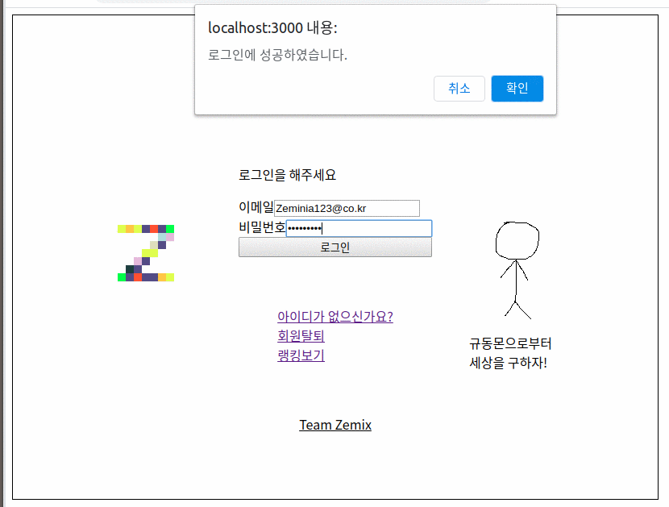
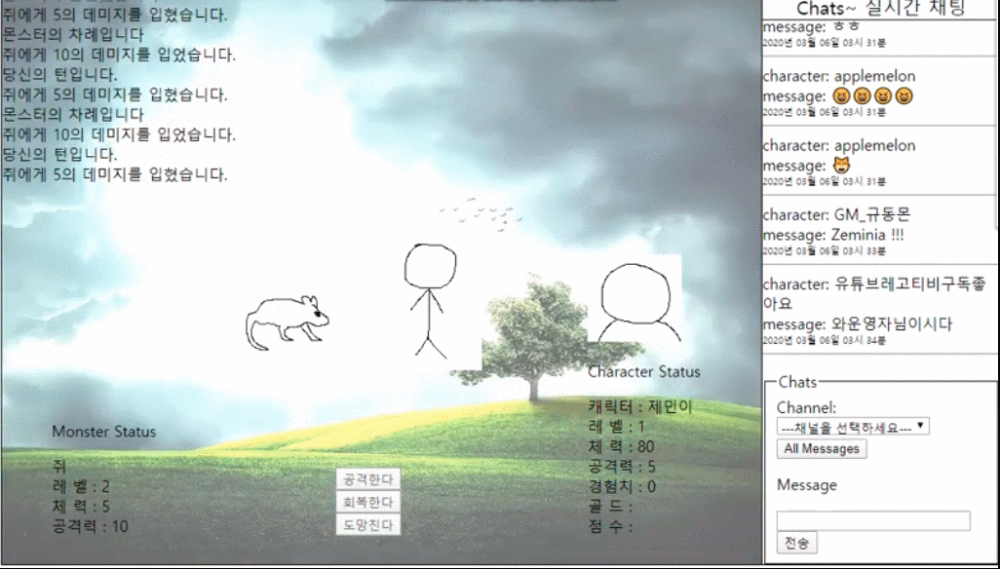
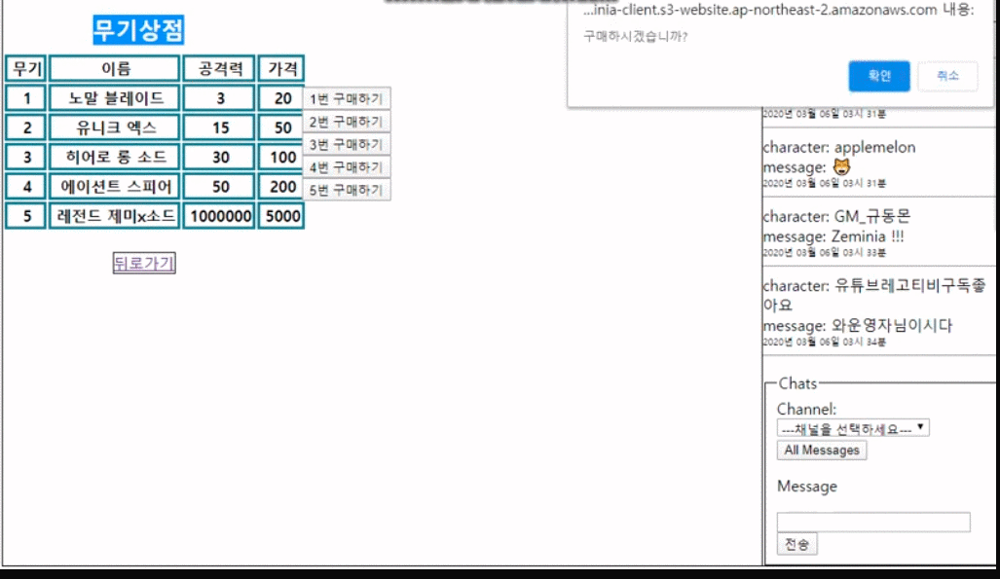
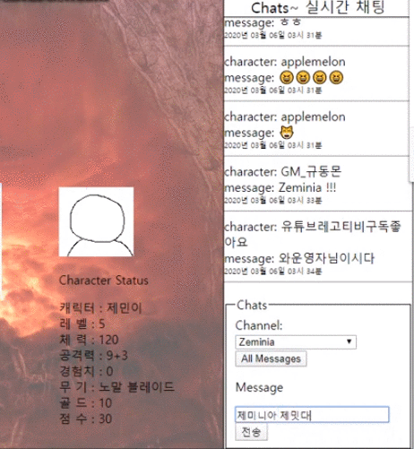
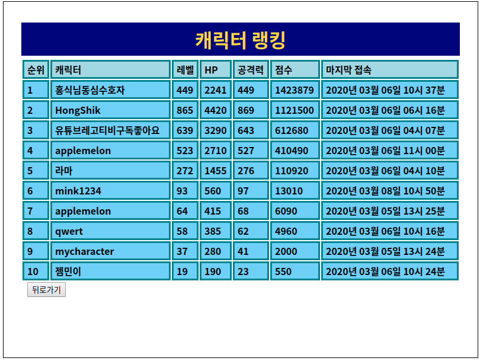

## Zeminia

### Zeminia란?

RPG 게임입니다. 턴제 전투를 통해 캐릭터를 성장시킬 수 있습니다.

### 소개

Zeminia의 clinet입니다.

팀 Zemix의 Front-end 두 명이 만들었습니다. (김지훈, 정범진)

페이지를 나누기 위해 React Router가 사용되었습니다.

게임 내 채팅을 위해 Socket.io모듈이 사용되었습니다.

### 핵심 기능 시연

계정 및 캐릭터 생성

전투 : 선택지에 따른 행동에 따라 턴제 전투가 진행됩니다.

상점 : 전투 중 모은 골드를 통해 아이템을 구매할 수 있습니다.

채팅 : 게임 내 실시간 채팅이 가능합니다.

랭킹 : 전투로 얻은 점수를 비교할 수 있습니다. (로그인 페이지에서 넘어갈 수 있습니다.)

좀 더 자세한 시연을 보고싶으시다면 다음 링크를 참고해주세요.
https://youtu.be/il3JQBGZCWU
